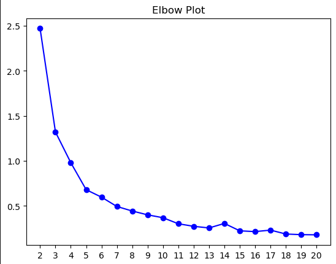
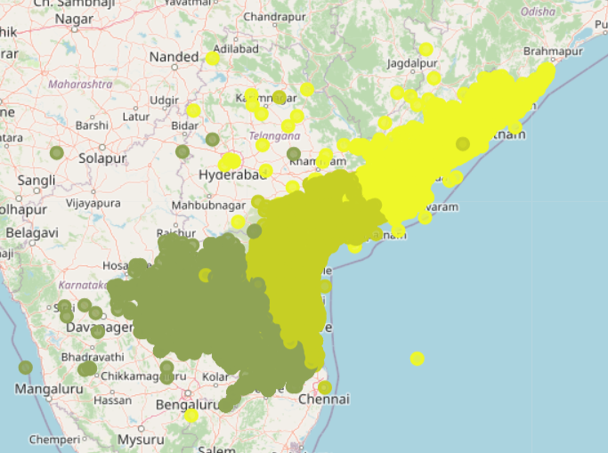
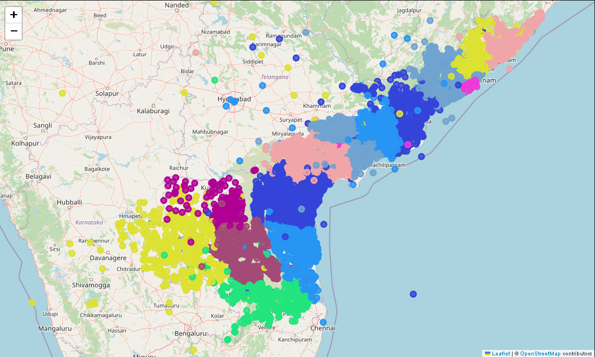

# [Task 1](./Task-1/)

## Data Cleaning:

- Clearly from printing unique values CircleName and StateName is the same for all the values so there is no need of this data.
- I noticed that there are null values in the Latitude and Longitude so fill these values with the mean of the geographical positions belonging to the same Division.
- I realized that there are some outliers from blox plot, so i removed the points using InterQuartileRange.
- I also checked if there were any duplicated rows.

## K-Means Clustering:

I initialized the centroids by randomly assign k points from the point as the centroids. Then the model calculates the distances between points and centroids, classifies them, calculates their mean and then reassigns the means as centroids. This process is repeated till the change in centroids is lower than a particular tolerence(in my case 0.01).

To find the optimum k, I took help of elbow plot, which basically calculates the inertias (sum of distances between centroids and points in that cluster) and plots them.

## Inferences and Results

- From the elbow plot clearly the optimum k is somewhere in between 10 to 15, and the number of district in the state is 13 and lies in this region. So the districts clearly divide the state in an optimum way.

- I verified this by using folium plots:  
  The first digit of a PIN indicates the zone, the second indicates the sub-zone, and the third, combined with the first two, indicates the sorting district within that zone. The final three digits are assigned to individual post offices within the sorting district.

- Some plots obtained:  
  
  
  

### References:

https://python-visualization.github.io/folium/latest/reference.html

# [Task 2](./Task-2/)

## My approach to the problem:

I observed that the target images were symmetrical and realized that a simple sliding window can easily iterate over each letter. So I iterated over the image array and in each interaction predicted the letter using CNN that I trained beforehand on the alphabets dataset and added it to the output string. To detect the space I say if the sum of all the pixel values is 0.

Now that I extracted the text from the images, I saw that the sentiment analysis dataset was not too big. So I thought that Deep learning may not work well on the data and I decided to go with clustering.

I vectorized the text using count vectorization, since the vocabulary size is also small(because of the small dataset) and using KNN I predicted their sentiments.

I also tried predicting the sentiments using LSTM (just for the sake of experimentation) and as expected the model was unable to predict properly.

## My model predictions:

- **line_1.png**: I AM REALLY ANNOYED BY YOUR CONSTANT COMPLAINING AND YOU NEVER OFFER ANY SOLUTIONS WHICH IS VERY UNHELPFUL AND NEGATIVE 
  **Predicted_sentiment**: Happy 
  **Actual_sentiment:** Angry

- **line_2.png** : IT IS FRUSTRATING THAT YOU NEVER PAY ATTENTION DURING DISCUSSIONS AND YOUR LACK OF FOCUS IS REALLY AFFECTING OUR PROGRESS 
  **Predicted_sentiment**: Angry 
  **Actual_sentiment:** Angry

- **line_3.png** : I AM DELIGHTED BY YOUR FRIENDLINESS AND YOU ALWAYS MAKE EVERYONE FEEL WELCOME WHICH FOSTERS A SENSE OF COMMUNITY 
  **Predicted_sentiment**: Happy 
  **Actual_sentiment:** Happy

- **line_4.png** : IT SS WONDERFUL THAT YOU ALWAYS SHOW KINDNESS ANO YOUR EMPATHY TOWARDS OTHERS IS TRULY HEARTWARMINT AND APPRECIATED 
  **Predicted_sentiment**: Happy 
  **Actual_sentiment:** Happy

- **line_5.png** : YOUR ANALYSIS OF THE DATA NAS ACCURATE AND WELL PRESENTED PROVIDING A CLEAR UNDERSTANDING OF THE TRENDS AND PATTERNS 
  **Predicted_sentiment**: Neutral 
  **Actual_sentiment:** Neutral

- **line_6.png** : THE MEETING MINUTES YOW PREPARED WERE DETAILED AND NELL ORGANIZED ACCURATELY REFLECTING THE DISCUSJIONS AND DECISIONS MADE 
  **Predicted_sentiment**: Neutral 
  **Actual_sentiment:** Neutral

### References:

https://www.kaggle.com/code/yairhadad1/cnn-for-handwritten-alphabets
